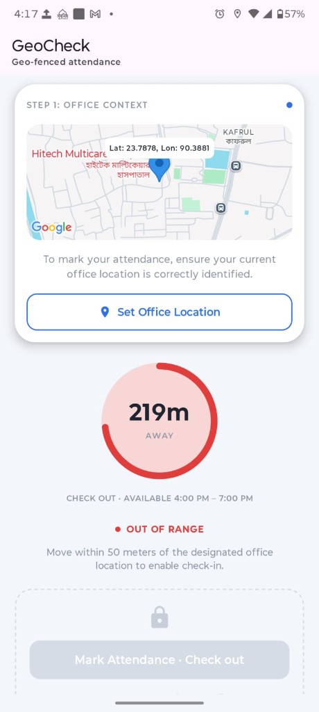
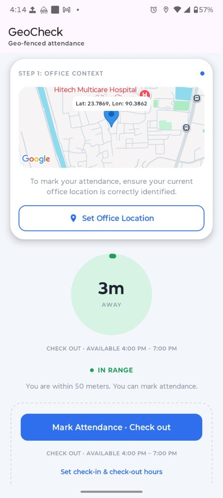
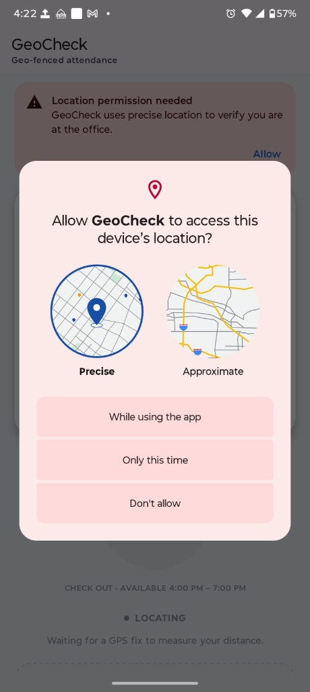
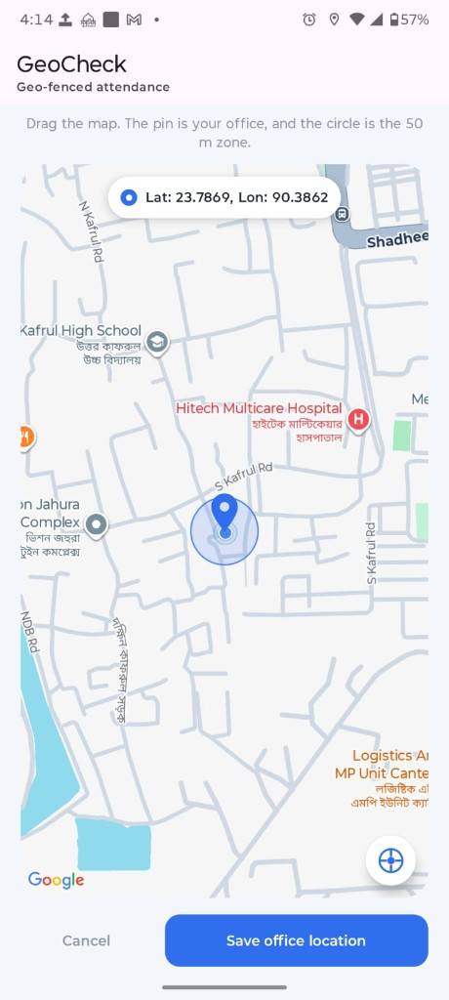

# GeoCheck: Geo-Fenced Attendance

GeoCheck is a native Android app (Kotlin + Jetpack Compose) for location-aware attendance. The user places the office on a map. **Mark Attendance** stays locked until the device is within **50 m** of that point and the current time falls inside the check-in or check-out window. A distance ring, a live map, and today's activity list show the result.

> Task 1 of the Senior App Developer Technical Assessment (Native Android).

## Features

- **Set Office Location** opens a full map. Drag it to drop the office pin, or tap the current-location button to snap the pin to the GPS fix, then save. The dashboard map shows a marker with the saved latitude and longitude above it.
- **Distance ring.** One scale, always 300 m. The arc grows with distance. Under 50 m the ring and its fill are green. Over 50 m they are red.
- **Mark Attendance** enables only inside the 50 m zone and inside the open time window. Check-in hours record a check-in. Check-out hours record a check-out. A second tap in the same window does not flip the other way.
- **Hours.** Defaults are check-in 9:00–10:30 AM and check-out 5:00–7:00 PM. **Set check-in & check-out hours** uses a 12-hour picker. Both the ring and the button show the window that applies right now.
- **Today's activity** lists today's check-ins and check-outs under the button. History survives an app restart.
- **Permissions and hardware.** Covers denied, permanently denied, and approximate-only location. If GPS is switched off, the app offers the system "turn on location" dialog. GPS runs only while the screen is visible.

## Project Structure / Approach

Layered **MVI-style MVVM**. The UI sends intents in and reads one `StateFlow`. Kotlin Flow is the state-management tool. `AttendanceViewModel` is the only state holder: it merges permission, GPS-on state, the office, the schedule, today's records, and the live location stream into `AttendanceUiState`. One-shot results (snackbars, permission requests) go out through a `Channel`. `GeofenceEvaluator` and `AttendanceSchedule.slotAt` are pure Kotlin, so the 50 m rule and the check-in / check-out rule are unit-tested without Android.

```
app/src/main/java/com/munjuralam/geocheck/
├── domain/
│   ├── model/          GeoPoint, LocationSample, OfficeLocation, AttendanceRecord, TimeWindow
│   ├── geofence/       haversine distance, 50 m rule, 300 m ring scale
│   └── repository/     AttendanceRepository, LocationTracker
├── data/
│   ├── local/          DataStore repository + attendance line codec
│   └── location/       FusedLocationTracker
├── di/AppContainer.kt  manual dependency injection
└── ui/attendance/      contract, ViewModel, screen, map, ring, schedule, activity list
```

### Tech stack

Kotlin, Jetpack Compose (Material 3), Coroutines and Flow, Lifecycle ViewModel, DataStore Preferences, Play services Location, Maps Compose, JUnit, kotlinx-coroutines-test.

## Technical notes

### Map integration

Two maps, both from `maps-compose`:

1. **Dashboard preview** (`OfficeContextCard`). Non-interactive. The camera is locked on the saved office. A blue marker (`BitmapDescriptorFactory.HUE_AZURE`) sits on that point, and a 10 sp label with `Lat: …, Lon: …` is drawn just above the pin. Gestures are off so the label stays over the marker and the page can still scroll.
2. **Set-office picker** (`OfficeMapPicker`). Gestures are on. A pin stays fixed in the centre while the map moves underneath it. The chosen point is `cameraPositionState.position.target` at save time, not a separate draggable marker. A 50 m circle is drawn around that target so the zone is visible before saving. The current-location button animates the camera to the latest `LocationSample`.

The Maps API key is not in source. `app/build.gradle.kts` reads `MAPS_API_KEY` from `local.properties` and injects it as the manifest placeholder `${MAPS_API_KEY}` on `com.google.android.geo.API_KEY`. `local.properties` is git-ignored.

Saving the office does not require a GPS fix. `AttendanceIntent.SaveOfficePoint` writes an `OfficeLocation` (latitude, longitude, timestamp) through `AttendanceRepository`. The current-location button is only a way to move the camera.

### Progress bar logic

`DistanceRingScale` uses one maximum: **300 m**.

```
fill = (distanceMeters / 300).coerceIn(0, 1)
sweep = fill * 360 degrees, starting at 12 o'clock
```

| Distance | Fill | Colour |
|---|---|---|
| 0 m | empty | green |
| 25 m | about 8% | green |
| 50 m | about 17% | green |
| 150 m | half | red |
| 300 m or more | full | red |

Green means `distance <= 50`. Red means farther than 50 m. The disc inside the ring uses a light green or light red of the same choice, so the track and the arc always match. The number in the centre is the raw distance (`120m`, `1.2km`), independent of the 300 m cap.

Distance itself is the haversine great-circle distance in `GeoDistance`, between the saved office and the latest GPS fix.

### Getting the current time

The clock is `System.currentTimeMillis`, passed into the ViewModel so tests can freeze it.

`minuteOfDay()` converts that instant to minutes from local midnight with `Calendar` (`HOUR_OF_DAY * 60 + MINUTE`). The schedule is stored the same way: each window is a pair of minutes, inclusive (`9:00` is `540`, `10:30` is `630`).

The 12-hour time picker (`TimePicker`, `is24Hour = false`) only changes the dial. `TimePickerState.hour` is still `0–23`, so 1:30 PM is stored as `13 * 60 + 30`. The labels on screen are formatted with `DateFormat.getTimeFormat`, which follows the phone's 12-hour or 24-hour setting.

`AttendanceSchedule.slotAt(minute)` decides what "now" means:

- Inside the check-in window → action is **check-in**, button may enable.
- Inside the check-out window only → action is **check-out**.
- Inside both → check-in wins, so a wide check-out range cannot steal a check-in hour.
- Inside neither → the button stays locked. The label shows the next window (check-in if it has not started, otherwise check-out).

Changing the hours writes four integers to DataStore. The schedule `Flow` emits, the ViewModel rebuilds `activeWindow` and `isWithinWindow`, and both the ring caption and the button caption update from that same state.

### Mark attendance process

`canMarkAttendance` is true only when all of these hold:

1. The latest fix is within 50 m of the office (`GeofenceEvaluator`: haversine `<= 50`). A weak or mocked fix still counts if the distance is inside the radius, because the assessment rule is the radius.
2. `slotAt` says the current minute is inside an open window.
3. A save is not already in progress.

The button label follows the slot: **Mark Attendance · Check in** or **Mark Attendance · Check out**.

On click the ViewModel checks the same rules again, then appends one `AttendanceRecord`: timestamp, type from the open slot, distance, and the GPS point. A second tap while check-in hours are still open records another check-in. It does not become a check-out. Check-out is recorded only when the check-in window is closed and the check-out window contains the current minute.

Outside the zone, the click is rejected with the distance. Outside the hours, it is rejected with the window that would have applied.

### Activity saving process

`DataStoreAttendanceRepository` keeps one Preferences DataStore file, `geocheck_attendance`.

| What | How it is stored |
|---|---|
| Office | `office_lat`, `office_lng` (double), `office_saved_at` (long) |
| Hours | four ints: check-in start/end, check-out start/end. A missing or invalid pair falls back to the default window |
| Today's and older marks | one string, newest first, at most 100 lines |

Each attendance line is `timestamp,type,distance,latitude,longitude`, encoded by `AttendanceRecordCodec`. A corrupt line is skipped instead of dropping the whole history. `addAttendanceRecord` reads the current string, prepends the new line, and writes it back inside one `dataStore.edit`, so two quick taps cannot lose a record.

The UI does not keep its own copy. `attendanceRecords` is a `Flow`. The ViewModel keeps only records whose timestamp is on or after local midnight and exposes them as `todayRecords`. `TodayActivityCard` renders that list: check-in or check-out, distance from the office, and the local time.

### Live location

`FusedLocationTracker` wraps `FusedLocationProviderClient` in a `callbackFlow`. Updates are high accuracy, about every 1–2 seconds, and only while the UI is subscribed, permission is granted, and device location is on (`flatMapLatest`). A `BroadcastReceiver` on `PROVIDERS_CHANGED_ACTION` tracks the GPS on/off switch. The first paint can use a last-known fix if it is younger than 30 seconds.

## Tests

`./gradlew testDebugUnitTest`

- `GeofenceEvaluatorTest`: haversine, inside / outside / boundary, low accuracy, mock.
- `DistanceRingScaleTest`: the 300 m fill, including the cap past 300 m.
- `AttendanceRecordCodecTest`: round-trip and corrupt lines.
- `AttendanceViewModelTest`: map point save, check-in hours stay check-in, check-out hours record check-out, button locked outside 50 m and outside the hours, weak GPS inside the zone, schedule update, permission state.

## Generative AI Usage

An AI coding assistant (Cursor) was used as a pair programmer. The architecture, the 50 m rule, and the hour rule were reviewed and adjusted by hand. AI was not left to invent the acceptance rules.

1. The assessment PDF was turned into acceptance criteria: set office, 50 m gate, live distance, permission and GPS-off handling.
2. The domain / data / ui split and the MVI contract were drafted, then changed to manual DI and DataStore instead of Hilt and Room.
3. Compose layout, string resources, and unit tests were drafted and then corrected when the behaviour was wrong (fixed ring, check-in flipping into check-out, 24-hour picker).

Essential prompts:

- *"This project is for a native geo attendance Android app. Check this attachment and create an app following the instructions."*
- *"Model the attendance screen as MVI: one StateFlow, intents in, one-shot events out. GPS runs only while the screen is visible."*
- *"The progress ring has one max of 300 m. Under 50 m it is green, over 50 m it is red."*
- *"If the button enables during check-in hours, the mark is only a check-in. Same for check-out. Do not flip on the next tap."*
- *"Write the README as interview documentation: map integration, progress-bar math, how the current time is taken, how mark attendance decides the type, and how activity is saved."*


## How to Run

**Requirements:** Android Studio (latest stable), JDK 17+, Android SDK 37, and a device or emulator with Google Play services.

1. Clone the repo and open it in Android Studio.
   ```bash
   git clone https://github.com/Monjur-Alam/GeoCheck.git
   cd GeoCheck
   ```
2. Put a Maps SDK for Android key in `local.properties` (this file is not committed):
   ```properties
   MAPS_API_KEY=YOUR_API_KEY
   ```
3. Run the `app` configuration, or:
   ```bash
   ./gradlew installDebug
   ```
4. Release APK: `./gradlew assembleRelease` writes `app/build/outputs/apk/release/app-release.apk`. Add `keystore.properties` (also git-ignored) to sign with your own key:
   ```properties
   storeFile=release.jks
   storePassword=...
   keyAlias=...
   keyPassword=...
   ```
   Without that file the release APK is signed with the debug key so it can still be installed.

On an emulator, set a location in Extended controls, save the office on that point, then move the point inside and outside 50 m. Set the check-in range so it includes the current time before expecting the button to enable.

## Screenshots

| Outside the zone | Inside the zone |
|---|---|
|  |  |

| Location permission | Set office on the map |
|---|---|
|  |  |
